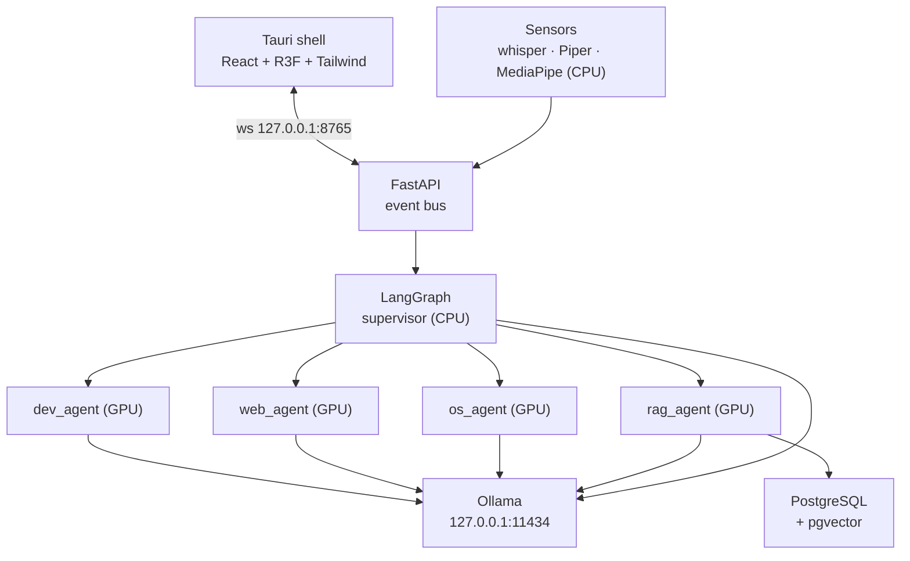

# Ultron — Architecture Document

Defines process topology, design principles, the WebSocket contract, and the model lifecycle strategy that every component builds against. Component-level implementation detail lives in the System Design document.

---

## 1. Process topology

Two long-running processes plus two local services, no network egress beyond loopback.



- **Tauri shell**: owns the window, tray, global hotkey, and spawns/monitors the backend as a sidecar process.
- **FastAPI backend**: single WebSocket endpoint, one event bus, one LangGraph instance, one Ollama model manager.
- **Ollama**: local model server; router/embedder pinned to CPU, exactly one worker model resident on GPU at a time.
- **PostgreSQL**: documents/chunks/episodes, LangGraph checkpoints, and the action registries (apps, media, contacts).

## 2. Design principles

**P1 — Offline is an invariant, not a default.**
Playwright runs behind a proxy that blackholes anything outside an allowlist during development; the Tauri content-security policy forbids remote origins; fonts and libraries are bundled, not fetched. A dependency that needs the network at runtime is the wrong dependency.

**P2 — One heavy model resident at a time.**
The supervisor is a small, always-warm CPU router. Workers are heavier and strictly transient on the GPU. Every routing decision is therefore also a memory decision — expanded in §4.

**P3 — One event bus, one direction of truth.**
The backend owns all state. The frontend renders events and computes none. Orb color, node-graph highlight, and the VRAM gauge are all subscriptions to the same event stream, which keeps the 3D layer stateless and trivially replayable.

**P4 — Agents are isolated by capability, not by prompt.**
Each worker is constructed with its own tool list and its own permissions, enforced by a capability registry rather than by instructing the model to behave. The dev agent cannot drive the mouse; the OS agent cannot query the vector store. This is what makes an autonomous loop safe enough to leave running.

**P5 — Fail visible.**
Every exception, tool timeout, and model-load failure becomes an `error` event rendered in the HUD with enough detail to debug from the UI. A silent agent failure is indistinguishable from a hang, and hangs destroy trust faster than errors do.

## 3. Request lifecycle

1. Hotkey or wake word → `faster-whisper` transcribes → `user_utterance` event sent to backend.
2. Supervisor node runs (CPU), emits `graph_node{node:"supervisor", status:"active"}`, classifies intent, returns a route.
3. Runtime calls `ollama_manager.worker(model)` — unloads any previous GPU tenant, loads the routed model, emitting `model` phase events throughout.
4. Worker executes tools, streaming `token` and `tool_call` events.
5. Worker returns; the manager evicts it from the GPU (`keep_alive=0`); supervisor decides to continue routing or finish.
6. Final answer → Piper TTS → `audio_level` events drive the orb while speaking.

Steps 3 and 5 determine whether the system feels fast or feels broken — see §4.

## 4. VRAM and model lifecycle strategy

Full model tier table and Ollama environment variables are specified in the Technical Requirements document. This section covers the architectural contract.

**Rule:** the GPU has exactly one tenant at a time, held under an async lock so two graph nodes can never race into it. CPU-resident models (router, embedder) never touch this lock and never occupy GPU memory.

```python
class OllamaManager:
    async def worker(self, model: str):
        """Async context manager: guarantees exclusive GPU tenancy."""
        async with self._gpu_lock:
            if self._gpu_tenant and self._gpu_tenant != model:
                await self._unload(self._gpu_tenant)   # evict previous tenant
            if self._gpu_tenant != model:
                await self._load(model, keep_alive="5m")
                self._gpu_tenant = model
            yield model
            # no unload here: the worker stays resident across the hops of one run
            # and is evicted by release() when the run ends
```

The worker stays resident across the hops of one run and is evicted by `release()` when the run ends. Every phase transition (`loading`, `ready`, `unloading`, `evicted`) is published to the event bus so the HUD can visibly communicate the ~1.5–3 s cold-load gap rather than presenting it as a freeze. A background telemetry loop polls VRAM via NVML at 1 Hz and publishes `vram` events for the gauge.

**Speculative warm (optional optimization):** fire the load for the routed model as soon as the supervisor's route decision is known, before its rationale finishes streaming — this hides most of the load latency behind the router's own generation tail.

## 5. WebSocket event contract

One envelope shape, one endpoint (`ws://127.0.0.1:8765/ws`), JSON text frames.

```ts
interface Envelope<T = unknown> {
  v: 1;
  id: string;           // uuid4, for correlation
  ts: number;            // epoch ms, backend clock
  type: EventType;
  run_id?: string;       // LangGraph thread id, groups one task
  payload: T;
}
```

### Backend → frontend

| `type` | Payload | Drives |
| --- | --- | --- |
| `state` | `{phase}` — idle / listening / thinking / acting / speaking / error | Orb color and pulse rate |
| `audio_level` | `{rms}` 0–1, ~30 Hz while speaking | Orb displacement during TTS |
| `graph_node` | `{node, status, ms?}` | Node graph highlight, edge beam |
| `token` | `{text, role, done}` | Streaming chat log |
| `tool_call` | `{agent, tool, args_preview, status}` | Status rail, activity ticker |
| `vram` | `{used_mb, total_mb, active_model}` | VRAM gauge |
| `model` | `{phase, model}` | Loading shimmer on target node |
| `error` | `{severity, source, message, traceback?}` | Error console |
| `transcript` | `{text, final}` | Interim STT display |
| `confirm_request` | `{action_id, description, risk}` | Confirmation modal |
| `screenshot` | `{action_id, png_b64, caption}` | Dev agent evidence panel |
| `snapshot` | current phase, active node, last 50 messages, VRAM | Reconnect resync |

### Frontend → backend

| `type` | Payload |
| --- | --- |
| `user_utterance` | `{text, source}` |
| `confirm_response` | `{action_id, approved}` |
| `cancel` | `{run_id}` |
| `mic` | `{enabled}` |
| `resync` | `{}` |
| `ping` | `{}` |

### Transport rules

- **Backpressure:** the connection manager holds a bounded `asyncio.Queue(maxsize=256)` per client. On overflow, it drops the oldest lossy event (`audio_level`, `vram`, `token`) and never drops a critical one (`state`, `error`, `graph_node`, `confirm_request`).
- **Reconnection:** exponential backoff capped at 5 s; on reconnect, the frontend sends `resync` and the backend replies with a single `snapshot` — never a replayed event log, which would re-animate completed work.
- **Ordering:** one asyncio task drains one queue per client; the send loop is never parallelized.
- **Auth:** loopback binding plus a session token generated at Tauri startup and passed as a query parameter.

## 6. Failure and safety architecture (summary)

Full detail — including the confirmation gate, protected-process list, and prompt-injection defenses — is in System Design §Automation and Guardrails. Architecturally, the requirement is: every tool is classified by risk at registration time, and any tool above "write-local" risk cannot execute without a round trip through `confirm_request` / `confirm_response` on the event bus, with timeout defaulting to denial.

---
*See companion documents: Product Requirements, Technical Requirements, System Design, Plan, and the Phase-Wise Plan.*
