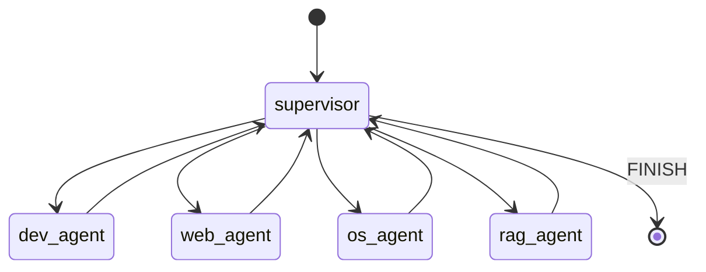
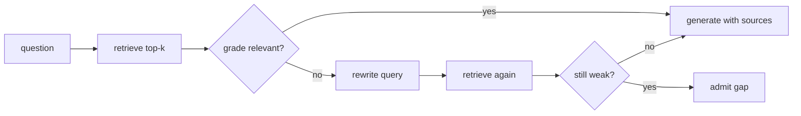

# Ultron — System Design Document

Component-level design: repository layout, the LangGraph agent system, the memory layer (including the personal/scripture/dialogue corpus split and action registries), sensory I/O, and the automation/safety guardrails. Assumes the Architecture document's topology, event contract, and model lifecycle rules.

---

## 1. Repository layout

```
ultron/
├── shared/
│   ├── events.schema.json        # single source of truth for the WS envelope
│   └── gen/                      # codegen output: events.d.ts, events.py
│
├── frontend-tauri/
│   ├── src-tauri/                # Rust: window config, hotkey, tray, sidecar mgmt
│   ├── src/
│   │   ├── App.jsx                # Canvas + HUD composition root
│   │   ├── three/                 # Orb, AgentGraph, AgentNode, DataBeam, Scene
│   │   ├── hud/                   # HUD, VramGauge, ErrorConsole, ChatLog, StatusRail
│   │   ├── hooks/                 # useUltronSocket, useAudioLevel, useAgentState
│   │   ├── store/ultronStore.js   # zustand: single store
│   │   └── styles/index.css       # Tailwind entry + glass utility layer
│   ├── tailwind.config.js
│   └── package.json
│
├── backend-ai/
│   ├── orchestrator.py            # FastAPI app + WS endpoint
│   ├── config.py                  # settings, model registry, device placement
│   ├── bus.py                     # EventBus: bounded pub/sub, lossy vs critical
│   ├── graph/
│   │   ├── state.py                # UltronState TypedDict
│   │   ├── supervisor.py           # router node, conditional edges
│   │   ├── builder.py              # StateGraph assembly + checkpointer
│   │   └── agents/                 # dev / web / os / rag agent factories
│   ├── llm/
│   │   ├── ollama_manager.py       # load/unload, GPU-exclusive lock, telemetry
│   │   └── prompts/                # one .md per agent role, hot-reloadable
│   ├── tools/
│   │   ├── browser.py              # Playwright wrapper, persistent context
│   │   ├── desktop.py              # pyautogui + subprocess, window-verified
│   │   ├── resolve.py              # fuzzy registry lookup
│   │   ├── vision.py               # screenshot + vision-model read
│   │   └── registry.py             # capability allowlist per agent
│   ├── memory/
│   │   ├── db.py                    # asyncpg pool
│   │   ├── vectorstore.py           # pgvector upsert/search
│   │   ├── ingest.py                # chunker + embedder CLI
│   │   └── schema.sql
│   ├── sensors/
│   │   ├── stt.py                   # faster-whisper + Silero VAD loop
│   │   ├── tts.py                   # Piper streaming synth
│   │   └── gestures.py              # OpenCV + MediaPipe hand landmarks
│   └── pyproject.toml
│
├── models/                        # gitignored: piper voices, whisper ct2, gguf
└── scripts/
    ├── bootstrap.ps1
    ├── pull_models.py
    └── check_vram.py
```

`tools/registry.py` makes capability isolation data, not discipline: each agent constructor takes a list of tool names, and the registry refuses to return anything outside it. `bus.py` sits between LangGraph and FastAPI so sensors and the VRAM poller publish through the same channel the WebSocket layer reads — the graph has no idea a UI exists.

## 2. LangGraph supervisor and sub-agents



### State

```python
class UltronState(TypedDict):
    messages: Annotated[list, add_messages]
    next: Literal["dev_agent","web_agent","os_agent","rag_agent","FINISH"]
    run_id: str
    hops: int          # hard loop ceiling
    scratch: dict       # cross-agent handoff: urls, file paths, screenshots
```

### Supervisor (CPU-resident router)

Structured JSON output only, never parsed prose — a 1.5–3B model produces reliable JSON under a tight schema and unreliable prose under any prompt.

```python
class Route(BaseModel):
    next: AgentName
    reason: str

SYSTEM = """You route tasks to exactly one worker.
dev_agent: code, terminal errors, VS Code, debugging.
web_agent: anything in a browser — search, shopping, forms.
os_agent:  apps, files, music, keyboard/mouse.
rag_agent: questions about the user's own notes or scripture.
FINISH:    the last worker already answered.
Return JSON only."""

MAX_HOPS = 8   # non-negotiable — a small router will ping-pong without it
```

### Worker pattern (single shared model, four roles)

With one worker model serving all four agents, there is no reason for four near-identical factories — one factory varies the prompt and tool list:

```python
def make_worker(name: str, bus, ollama):
    prompt = Path(f"llm/prompts/{name}.md").read_text()

    async def node(state):
        async with ollama.worker(settings.worker_model) as model:
            llm = ChatOllama(model=model, temperature=0.1, keep_alive="5m")
            agent = create_react_agent(llm, tools=tools_for(name), prompt=prompt)
            out = await agent.ainvoke({"messages": state["messages"]},
                                      {"recursion_limit": 12})
        return {"messages": out["messages"][-1:]}
    node.__name__ = name
    return node
```

Because all four agents share one resident model, consecutive hops between them cost zero swap time — the `worker()` context sees the model already resident and skips straight to ready.

### Dev agent

Loop: locate the VS Code window → screenshot the terminal panel region → read with the vision model → diagnose. Prefer a vision model over OCR — terminal output is dense, colored, and has ANSI artifacts that a vision model reasons over more reliably than raw text extraction.

### RAG agent — CRAG loop



The grader is a separate cheap call on the CPU-resident router, scoring each chunk yes/no for relevance before generation — the generator never sees irrelevant context. The corrective branch caps at one rewrite; a second poor retrieval returns an explicit "not in my notes" rather than a fabricated answer.

## 3. Memory layer

### Schema

```sql
CREATE EXTENSION IF NOT EXISTS vector;
CREATE EXTENSION IF NOT EXISTS pg_trgm;

CREATE TABLE documents (
  id BIGSERIAL PRIMARY KEY, source_path TEXT UNIQUE, title TEXT,
  mime TEXT, sha256 TEXT NOT NULL, ingested_at TIMESTAMPTZ DEFAULT now()
);

CREATE TABLE chunks (
  id BIGSERIAL PRIMARY KEY,
  document_id BIGINT REFERENCES documents(id) ON DELETE CASCADE,
  ordinal INT NOT NULL, content TEXT NOT NULL, token_count INT,
  embedding VECTOR(768) NOT NULL,
  collection TEXT NOT NULL DEFAULT 'personal'
    CHECK (collection IN ('personal','scripture','dialogue')),
  chapter INT, verse INT,                     -- scripture metadata
  UNIQUE (document_id, ordinal)
);

CREATE TABLE episodes (
  id BIGSERIAL PRIMARY KEY, run_id TEXT NOT NULL, agent TEXT NOT NULL,
  summary TEXT NOT NULL, embedding VECTOR(768),
  outcome TEXT CHECK (outcome IN ('ok','failed','cancelled')),
  created_at TIMESTAMPTZ DEFAULT now()
);

CREATE INDEX chunks_hnsw ON chunks USING hnsw (embedding vector_cosine_ops)
  WITH (m = 16, ef_construction = 64);
CREATE INDEX chunks_trgm ON chunks USING gin (content gin_trgm_ops);
CREATE INDEX chunks_collection ON chunks (collection);
```

LangGraph's `AsyncPostgresSaver` creates its own checkpoint tables on first run (`await saver.setup()` once during bootstrap).

### Three collections, not one

| Collection | Content | Usage | Retrieved as fact? |
| --- | --- | --- | --- |
| `personal` | User's own notes, preferences, projects | Normal RAG: retrieve → grade → cite | Yes |
| `scripture` | Gita verses, one chunk per verse | Retrieved only for scripture-tagged queries | No |
| `dialogue` | Sample exchanges (style examples) | Top 2–3 injected into system prompt as `<style_examples>` | **Never** |

The `dialogue` collection must never enter the retrieval context as evidence — if it does, the worker model will answer factual questions with lines from an old conversation. It is excluded from the retrieval query entirely and surfaced only via a separate few-shot lookup at prompt-construction time.

Verses are chunked one-per-verse with `chapter`/`verse` metadata so exact lookups ("what does 2.47 say") are metadata queries, not similarity guesses. At this corpus scale (500–5,000 chunks), HNSW buys negligible speed over a sequential scan — the index exists for future growth, and the grader (not the index) is what prevents a loosely related verse from being presented as an answer.

### Retrieval — hybrid, rank-fused

Two branches, both scoped to the requested collection(s) in the query itself (`memory/vectorstore.py`):

- **Vector branch:** cosine distance over the HNSW index, top 20 candidates.
- **Lexical branch:** PostgreSQL full-text search (`chunks_fts`) using the question's distinctive words OR-ed together (stop words dropped), top 20 candidates ranked by `ts_rank_cd`.

The two candidate lists are fused in Python with reciprocal rank fusion (k=60) and the top 4 go to the grader. The lexical branch deliberately does not use a `pg_trgm` `content % query` match: that compares a whole question with a whole chunk, and a 400–600 token chunk almost never reaches the trigram similarity threshold against a short question, so it returns almost nothing. `chunks_trgm` stays for later fuzzy matching. Hybrid beats pure vector search here because personal notes are searched by remembered exact strings (a filename, a name) as often as by meaning.

### Action registries

Not vector data — lookup tables the OS agent resolves commands against, populated during setup rather than at runtime:

```sql
CREATE TABLE registry_apps (
  id BIGSERIAL PRIMARY KEY, name TEXT NOT NULL,
  aliases TEXT[] DEFAULT '{}', launch_cmd TEXT NOT NULL,
  process_name TEXT, protected BOOLEAN DEFAULT false
);

CREATE TABLE registry_media (
  id BIGSERIAL PRIMARY KEY, title TEXT NOT NULL, artist TEXT,
  path TEXT NOT NULL, tags TEXT[] DEFAULT '{}', embedding VECTOR(768)
);

CREATE TABLE registry_contacts (
  id BIGSERIAL PRIMARY KEY, name TEXT NOT NULL,
  aliases TEXT[] DEFAULT '{}', phone TEXT,
  channel TEXT CHECK (channel IN ('whatsapp','sms','email'))
);
```

### Tuning

| Setting | Value | Why |
| --- | --- | --- |
| `hnsw.ef_search` | 64–100 | Recall/latency dial |
| `maintenance_work_mem` | 2 GB for index builds only, then drop to 512 MB | HNSW build is dramatically slower below this; 16 GB RAM can't sustain it as a standing default |
| `shared_buffers` | 1 GB | Windows/16 GB-RAM ceiling — the usual 25%-of-RAM guidance over-allocates here |
| Chunk size | 400–600 tokens, 15% overlap (personal); one verse (scripture) | Small enough to grade, large enough to answer |

## 4. Command surface

**The model never guesses at names.** Every actionable command resolves through a registry table first:

```python
async def resolve(pool, kind: str, phrase: str, limit: int = 3) -> list[dict]:
    table = {"app":"registry_apps","media":"registry_media","contact":"registry_contacts"}[kind]
    rows = await pool.fetch(f"SELECT * FROM {table}")
    hay = {r["id"]: " ".join([r["name"], *(r.get("aliases") or [])]) for r in rows}
    hits = process.extract(phrase, hay, scorer=fuzz.WRatio, limit=limit)
    return [dict(next(r for r in rows if r["id"]==rid), score=score)
            for _, score, rid in hits if score > 60]
```

One confident match executes; multiple close matches prompt a disambiguation; no match returns a plain "I don't have that registered" rather than an improvised `pyautogui` guess.

### Apps

| Command | Implementation | Risk gate |
| --- | --- | --- |
| "open X" | `os.startfile(launch_cmd)` | Auto |
| "close X" | `taskkill /IM {process_name}` (graceful, no `/F`) | Auto |
| "force close X" | `taskkill /F /IM {process_name}` | **Confirm** |
| "close everything" | Enumerate visible windows, subtract protected set, list, then close | **Confirm, with the list shown** |

Protected set is hard-coded, not a database column: `explorer.exe`, `ollama.exe`, `postgres.exe`, the Python backend, the Tauri app itself. "Close everything" must never be able to kill the system's own dependencies.

### Music

Local library first: files are indexed once via a `mutagen` tag scan into `registry_media`, embedded on `title + artist + tags` for fuzzy/semantic requests ("play something calm"), and a request is resolved by fuzzy match on `registry_media` and played through `mpv`. If there is no local match and the internet is reachable, fall back to `mpv` + `yt-dlp` (`ytdl://ytsearch1:<query>`). "Open YouTube Music" explicitly goes through the web agent. Offline with no local match says so. The online path is a second audited network-egress exception (alongside the Playwright allowlist) and must fail visibly. Playback via `mpv --idle=yes` with a JSON IPC socket for real transport control (play/pause/skip/volume). Duck volume to ~25% while TTS is speaking and restore afterward.

### WhatsApp

Two routes, not equivalent:

| Route | Can send | Can read incoming | Cost |
| --- | --- | --- | --- |
| `whatsapp://send?phone=...&text=...` protocol handler | Composes only, user presses Enter | No | Trivial, robust |
| WhatsApp Web via Playwright persistent context | Yes | Yes | Selector maintenance, session-drift risk |

**Default route is the protocol handler.** It opens the target chat pre-filled and stops — the send is a human keystroke, which aligns with the confirmation-gate requirement without needing a gate at all. Reading and auto-drafting via WhatsApp Web is a later-phase option, and any content scraped from it is untrusted input subject to the prompt-injection defenses below.

## 5. Sensory I/O

- **STT**: `faster-whisper base.en`, CPU, int8, fed by a Silero VAD loop that buffers audio while speech is detected and transcribes on ~700 ms of silence. Publishes `audio_level` at ~30 Hz for the orb and `transcript` on completion.
- **TTS**: Piper, streamed per sentence rather than per paragraph so the orb starts reacting within ~150 ms of the first token, not after the full answer synthesizes. CPU-only; costs no VRAM.
- **Gestures** (optional, off by default): MediaPipe Hands at 15 fps on a 480p capture. Vocabulary kept to three reliable gestures — open-palm-held (mic toggle), pinch (cancel), swipe-left (dismiss error console) — each debounced with a 1 s cooldown and a 5-consecutive-frame pose requirement, published as a `gesture` event rather than calling actions directly so the UI can confirm visually.

## 6. Automation and guardrails

### Browser (Playwright)

One persistent context for the session (`launch_persistent_context`, headful — the user must see it, `--disable-gpu` to reclaim ~250–350 MB from the compositor). Agents read the accessibility tree (`page.locator("body").aria_snapshot()`), not raw HTML — a few hundred lines of roles and names versus tens of thousands of tokens of wrapper divs.

### Desktop control

`pyautogui` paired with `pygetwindow` — the active window is verified before every click, never assumed:

```python
def focus(title_contains: str, timeout: float = 3.0):
    for w in gw.getWindowsWithTitle(title_contains):
        if w.isMinimized: w.restore()
        w.activate(); time.sleep(0.4)
        if title_contains.lower() in (gw.getActiveWindow().title or "").lower():
            return w
    raise RuntimeError(f"window {title_contains!r} not focused")
```

CLIs and protocol handlers are preferred over GUI navigation wherever one exists (`code .` over clicking an icon, `whatsapp://` over navigating a chat list).

### The confirmation gate

| Risk | Examples | Policy |
| --- | --- | --- |
| Read | screenshot, read_page, vector search | Auto |
| Navigate | goto, scroll, launch an app | Auto |
| Write-local | create a file, type into an editor | Auto, logged |
| Send | post a message, submit a form | **Confirm** |
| Destructive | delete, overwrite, force-close, "close everything" | **Confirm, with a diff/list** |

```python
async def require(bus, description: str, risk: str, timeout: float = 60) -> bool:
    aid = secrets.token_hex(6)
    fut = asyncio.get_running_loop().create_future()
    _pending[aid] = fut
    await bus.publish({"type":"confirm_request",
                       "payload":{"action_id":aid,"description":description,"risk":risk}})
    try:
        return await asyncio.wait_for(fut, timeout)
    except asyncio.TimeoutError:
        return False          # silence is refusal, never consent
    finally:
        _pending.pop(aid, None)
```

### Prompt injection

Text read from a web page or a WhatsApp message is untrusted data, never instructions:

1. Wrap all scraped content in delimiters; instruct the agent that content inside them describes the page and never commands it.
2. Keep the confirmation gate outside the model's reach entirely — approval arrives only via a human click over the WebSocket, so an injected instruction cannot approve its own action.
3. Log every tool call with its arguments to `episodes` so an unexplained action is reconstructable after the fact.

### Kill switch

Three independent layers: `pyautogui.FAILSAFE` (mouse to a screen corner aborts), a global hotkey that cancels the active run and closes the browser context, and a tray item that terminates the backend sidecar entirely. All three must be verified working before the system runs unattended for the first time.

---
*See companion documents: Product Requirements, Technical Requirements, Architecture, Plan, and the Phase-Wise Plan.*
